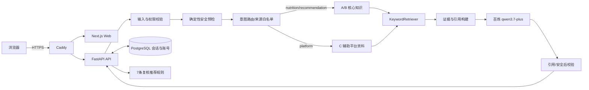

# 系统架构说明

## 1. 技术选型与平台理由

系统采用 Next.js/React/TypeScript Web、FastAPI/Pydantic API、PostgreSQL、Docker Compose 和 Caddy。Next.js 适合快速交付响应式单页体验并进行生产构建；FastAPI 能以强类型模型生成 OpenAPI，使前后端错误、档案和推荐契约保持一致；PostgreSQL 用于匿名/账号身份、会话和对话历史的持久化；Docker 镜像保证本地与 ECS 使用同一运行单元；Caddy 在公网入口负责 HTTPS 和反向代理。生产 LLM 为阿里云百炼 `qwen3.7-plus`，通过 OpenAI-compatible Provider Adapter 调用，密钥只存在服务器 Secret 文件。三份资料规模小且来源/数字敏感，因此当前使用可审计关键词检索，Embedding 明确禁用，不为了技术复杂度牺牲可解释性。

## 2. 当前生产架构

知识资料在构建前离线解析为带 `source_code`、来源角色、文档名、章节、页码、Chunk ID、哈希和允许路由的 JSONL；API 镜像加载这些只读产物。营养/推荐/禁忌路由只允许 A/B，平台路由只允许 C，混合问题在检索层保证两类证据配额。C 无法被推荐服务访问。PostgreSQL 不保存健康档案；档案仅随请求临时参与安全与推荐，减少敏感数据持久化。

## 3. 核心工作流与 Prompt

问答工作流依次执行：请求体和 2000 字边界校验；S0～S3 安全分级；确定性意图路由；按允许来源关键词评分与受控别名提示；证据不足门；构造只包含本轮证据、最近四轮可用上下文和临时档案的 Prompt；调用真实模型；验证每条事实是否带允许的 `【A-p01-c01】` 类引用，并再次检查医疗安全。Prompt 明确要求只能使用 EVIDENCE、每句只陈述一个事实、引用紧随事实、不得编造诊断或资料外数字。首次输出失败时只允许一次受约束修复；仍失败则生成直接引用资料的确定性证据回退，回退也失败时返回稳定错误，不展示草稿。

结构化推荐不让 LLM 选择候选。用户目标映射到轻盈减脂、力量增肌或稳糖调理的已复核规则组合；禁忌和疾病先硬过滤，再生成一个主方案、匹配原因、关键目标、三步行动、替换组和 A/B 页码证据。45–64 岁必须填写精确年龄，只有资料 B 18–55 岁适用范围内且年龄段一致才进入推荐。

## 4. 多轮、账号与异常处理

匿名访问先获得服务端 session，注册可把匿名历史迁移到账号；登录后可列出、搜索、改名、删除和恢复对话。只有通过最终校验的完整回答才与用户消息一起写入 PostgreSQL；S3 安全记录可见但标记为不可进入后续模型上下文，主动取消和失败半成品不落库。账号令牌只通过 Authorization header 发送，公开 URL 不携带 Secret。

错误处理保留 `code`、`request_id`、`retryable` 和 HTTP 状态。空输入显示“请输入您的问题”，超长显示“输入内容过长，请精简后重试”，系统异常用户区域显示“服务繁忙，请稍后重试”；客户端超时、Provider 超时、证据不足、数据库不可用和主动取消仍使用不同错误码与恢复动作。Web 在请求期间显示加载/停止状态，成功后清空输入，失败时保留输入并在可重试场景复用同一请求编号。

## 5. 部署、环境变量与回滚

公网部署为 Caddy + Web + API + PostgreSQL 四容器，只有 Caddy 暴露 80/443，其他端口绑定回环地址。API/Web 镜像在可信构建机生成并做 SHA-256 双端核验，服务器只 `docker load`，不接收源码、不构建。`.env.example` 和 `infra/ecs.env.example` 列出全部配置占位符；真实百炼 Key、数据库密码不进入仓库。发布只替换 API/Web，数据库卷和 Caddy 证书卷保留；失败时切回上一已知良好镜像并复用原卷。

## 6. 验收策略

架构验收覆盖 OpenAPI 与前端类型同步、Python/Web 全量测试、Ruff/ESLint/TypeScript/Next 构建、A/B/C 串库测试、7 条推荐规则、S0～S3、空/长/特殊/无关输入、多轮与账号权限、密钥扫描、Compose 生命周期、公网 HTTPS/真实模型/浏览器控制台以及部署前后容器镜像和重启次数不变量。证据统一保存到 `docs/evidence` 和 `control/records`。
