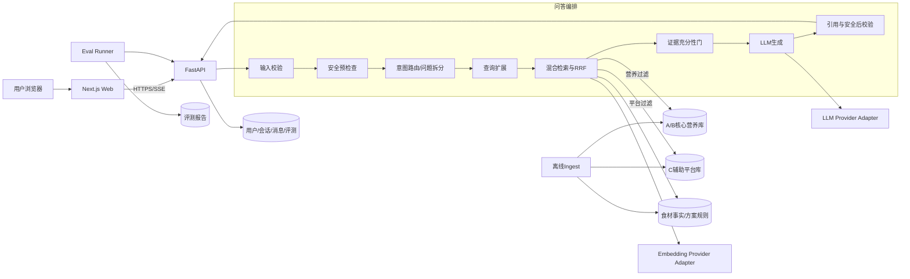
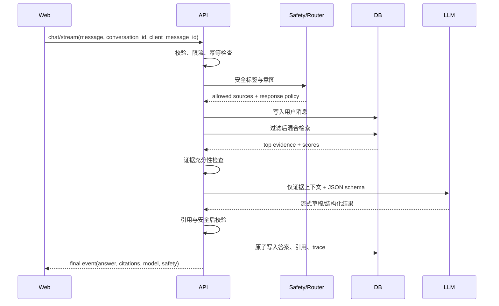

# 系统架构设计

## 1. 架构目标

架构必须同时满足：动态 LLM、知识隔离、来源引用、确定性安全、多轮记忆、历史持久化、公网部署、本地一键运行和自动评测。三份资料规模较小，因此优先保证可解释性和召回，不做过早分布式化。

## 2. 逻辑架构



隔离要点：A/B 与 C 可以位于同一 PostgreSQL 实例，但必须拥有不同 `source_role`，查询必须先应用角色过滤再排序。不能先检索全库后让 LLM 自行忽略 C。

## 3. 服务职责

### 3.1 Next.js Web

- 页面、响应式布局和可访问性；
- 会话历史、健康档案和快捷操作；
- SSE 流式事件消费；
- 答案、引用、免责声明和透明度元数据展示；
- 不在浏览器中持有模型密钥；
- 只做非敏感的即时校验，服务端再次验证。

### 3.2 FastAPI

- API 契约和 Pydantic schema；
- 鉴权、会话权限和幂等；
- 问答编排、规则引擎和 Provider adapter；
- 数据库事务、迁移和审计日志；
- 离线 ingest/评测入口；
- 统一错误处理和健康检查。

### 3.3 PostgreSQL + pgvector

- 用户、档案、会话、消息和引用；
- 文档 manifest、Chunk 和 embedding；
- 结构化食材事实和方案规则；
- retrieval trace 与 eval run；
- 小规模语料采用精确向量查询；
- 关键词层使用规范化关键字、别名和字符相似度；
- 数据增长或实测延迟不达标后再评估 HNSW。

### 3.4 Provider Adapter

业务层只依赖内部接口：

```text
LLMClient.generate(messages, response_schema, timeout) -> GenerationResult
LLMClient.stream(messages, response_schema, timeout) -> AsyncIterator[Event]
EmbeddingClient.embed(texts) -> list[vector]
```

Provider、模型名、Base URL、超时和维度均由环境变量提供。每条 assistant message 保存实际 provider/model，前端如实展示。

## 4. 请求时序



只有最终校验通过的答案才持久化为 `completed`。超时或中断消息保存为 `failed/cancelled`，以便 UI 允许重试而不产生重复答案。

## 5. 内部模块边界

建议 FastAPI 目录：

```text
apps/api/app/
├─ api/                 # route 和依赖注入
├─ core/                # settings、security、errors、logging
├─ db/                  # models、repositories、migrations
├─ schemas/             # 外部/内部 Pydantic 契约
├─ chat/                # 会话服务和流式事件
├─ routing/             # 意图、混合问题拆分、置信度
├─ retrieval/           # lexical/vector/RRF/evidence gate
├─ recommendations/     # 方案匹配和替换规则
├─ safety/              # 风险标签、拒答、免责声明
├─ citations/           # 引用映射和校验
├─ providers/           # LLM/embedding adapter
├─ ingest/              # PDF/表格/Chunk/manifest
└─ evals/               # 数据集和指标
```

Web 目录：

```text
apps/web/src/
├─ app/                 # 页面与 route groups
├─ components/          # chat、citation、plan、profile、history
├─ features/            # 按业务能力组织状态和 API 调用
├─ lib/                 # API client、SSE、format、validation
├─ generated/           # OpenAPI 生成类型，不手改
└─ styles/              # token 与全局样式
```

## 6. 数据一致性

- 消息正文、引用和 retrieval trace 使用同一数据库事务提交；
- `client_message_id` 在用户/会话范围内唯一；
- 每条引用固定到 `document_id + content_hash`，资料重建后旧回答仍可复核；
- Embedding 记录模型和维度，模型变更必须整批重建，禁止同一索引混用维度；
- 删除会话级联删除消息和健康上下文快照；
- 删除账号使用后台任务清除个人数据，但保留匿名聚合评测统计。

## 7. 错误与降级

统一错误码示例：

- `INPUT_EMPTY`
- `INPUT_TOO_LONG`
- `RATE_LIMITED`
- `EVIDENCE_INSUFFICIENT`
- `SAFETY_RESTRICTED`
- `MODEL_TIMEOUT`
- `MODEL_UNAVAILABLE`
- `DATABASE_UNAVAILABLE`
- `INTERNAL_ERROR`

降级顺序：

1. LLM 主 Provider 超时后只重试一次；
2. 配置了备用 Provider 时切换，并在元数据中标注；
3. Embedding 失败可退化为关键词检索，但仍需证据门；
4. 任一安全或引用校验失败时不返回未经验证的草稿；
5. 前端保留用户输入并显示可重试状态。

## 8. 部署拓扑

公网环境可分为 Web、API、托管 PostgreSQL 三个组件。Docker Compose 环境包含相同逻辑组件。两种环境必须使用同一迁移、seed 和健康检查，避免“线上能跑、本地不能跑”或相反。

## 9. 架构验收

- OpenAPI 可生成且 Web 类型与之同步；
- 数据库从空库执行迁移和 seed 后可用；
- A/B/C 隔离由集成测试验证；
- 主 Provider 切换不改业务代码；
- 删除会话后无法通过 API 越权访问；
- 模型超时、数据库断开和证据不足均返回稳定错误事件；
- 公网与 Docker Compose 都通过同一 smoke suite。

